# Sports Cart Frontend

SPA del e-commerce SportCart, construida con React, Redux Toolkit y Tailwind CSS. Consume la API REST serverless.

---

## Tabla de contenidos

- [Instalación y ejecución](#instalación-y-ejecución)
- [Rutas de la aplicación](#rutas-de-la-aplicación)
- [Stack tecnológico](#stack-tecnológico)
- [Características principales](#características-principales)
- [Arquitectura del proyecto](#arquitectura-del-proyecto)
- [Estructura de carpetas](#estructura-de-carpetas)
- [Capturas de pantalla](#capturas-de-pantalla)

---

## Instalación y ejecución

### Requisitos previos

- Node.js 20+
- pnpm 8+
- El backend corriendo en `http://localhost:3000/v1`

### Pasos

```bash
# Desde la raíz del frontend
pnpm install
cp .env.example .env
pnpm dev
```

La aplicación corre en **http://localhost:5173**.

### Scripts disponibles

| Comando | Descripción |
|---|---|
| `pnpm dev` | Servidor de desarrollo con hot-reload |
| `pnpm build` | Build optimizado de producción |
| `pnpm preview` | Previsualizar el build localmente |
| `pnpm lint` | Verificar reglas de ESLint |
| `pnpm lint:fix` | Corregir errores de lint automáticamente |
| `pnpm format` | Formatear el código con Prettier |

---

## Rutas de la aplicación

| Ruta | Página | Acceso | Descripción |
|---|---|---|---|
| `/` | HomePage | Pública | Landing con CTA al catálogo |
| `/login` | LoginPage | Solo invitados | Formulario de login |
| `/register` | RegisterPage | Solo invitados | Formulario de registro |
| `/products` | ProductsPage | Pública | Catálogo paginado con filtros |
| `/products/:id` | ProductDetailPage | Pública | Detalle individual |
| `/cart` | CartPage | Pública | Carrito de compras |
| `/checkout` | CheckoutPage | Requiere auth | Flujo de checkout en 3 pasos |
| `/orders` | OrderHistoryPage | Requiere auth | Historial paginado |
| `/orders/:orderId` | OrderDetailPage | Requiere auth | Detalle con tracking |
| `*` | NotFoundPage | Pública | 404 con CTA al inicio |

### Guards implementados

- **`ProtectedRoute`**: requiere autenticación, redirige a `/login` si no hay sesión.
- **`GuestOnlyRoute`**: para `/login` y `/register`. Si ya estás autenticado, redirige al catálogo.

---

## Stack tecnológico

| Categoría | Tecnología |
|---|---|
| Build tool | Vite |
| Framework | React 18 + TypeScript |
| Estado global | Redux Toolkit + RTK Query |
| Routing | React Router v6 |
| Estilos | Tailwind CSS |
| Forms | React Hook Form + Zod |
| Notificaciones | Sonner |
| Iconos | Material Symbols + Lucide React |
| Tipografía | Manrope (Google Fonts) |
| Package manager | pnpm |

---

## Características principales

- **Autenticación JWT** con persistencia en localStorage y logout automático en 401
- **Carrito híbrido**: persiste en localStorage sin sesión y se sincroniza automáticamente al backend al iniciar sesión.
- **Catálogo de productos** con paginación cursor-based, filtrado por categoría y detalle individual
- **Checkout en 3 pasos**: dirección de envío, método de pago y revisión final
- **Historial de órdenes** paginado con tracking visual del estado del envío
- **Diseño responsive** mobile-first con Tailwind
- **Loading states** con skeletons y empty states
- **Validación cliente y servidor** con Zod
- **Cache automático** con RTK Query: invalidaciones inteligentes después de mutaciones

---

## Arquitectura del proyecto

El frontend sigue una organización **feature-based** donde cada feature de negocio (auth, products, cart, orders) tiene sus propias capas independientes:

```
┌─────────────────────────────────────────────────────────┐
│                       PAGES                             │
│           Orquestan features y consumen hooks           │
└─────────────────────────────────────────────────────────┘
                          │
                          ▼
┌─────────────────────────────────────────────────────────┐
│                    FEATURES                             │
│   ┌─────────┐  ┌─────────┐  ┌─────────┐  ┌─────────┐   │
│   │  auth   │  │products │  │  cart   │  │ orders  │   │
│   ├─────────┤  ├─────────┤  ├─────────┤  ├─────────┤   │
│   │   api   │  │   api   │  │   api   │  │   api   │   │
│   │  hooks  │  │  hooks  │  │  hooks  │  │  hooks  │   │
│   │  store  │  │  comps  │  │  store  │  │  comps  │   │
│   │  comps  │  │         │  │  comps  │  │         │   │
│   │ guards  │  │         │  │         │  │         │   │
│   └─────────┘  └─────────┘  └─────────┘  └─────────┘   │
└─────────────────────────────────────────────────────────┘
                          │
                          ▼
┌─────────────────────────────────────────────────────────┐
│                     SHARED                              │
│   Componentes UI, hooks, utils, types compartidos      │
└─────────────────────────────────────────────────────────┘
```

---

## Estructura de carpetas

```
frontend/
├── public/
├── index.html
├── vite.config.ts
├── tailwind.config.js
├── tsconfig.json
├── .env
├── .env.example
├── package.json
└── src/
    ├── main.tsx
    ├── App.tsx
    ├── index.css
    │
    ├── app/                        # Configuración de la aplicación
    │   ├── store.ts                # Redux store con todos los slices y APIs
    │   ├── hooks.ts                # useAppDispatch, useAppSelector tipados
    │   ├── router.tsx              # Configuración de React Router
    │   └── providers/
    │       └── AppProviders.tsx    # Provider Redux + Toaster
    │
    ├── pages/                      # Páginas mapeadas a rutas
    │   ├── HomePage.tsx
    │   ├── LoginPage.tsx
    │   ├── RegisterPage.tsx
    │   ├── ProductsPage.tsx
    │   ├── ProductDetailPage.tsx
    │   ├── CartPage.tsx
    │   ├── CheckoutPage.tsx
    │   ├── OrderHistoryPage.tsx
    │   ├── OrderDetailPage.tsx
    │   └── NotFoundPage.tsx
    │
    ├── features/                   # Features de negocio
    │   ├── auth/
    │   │   ├── api/                # authApi (RTK Query) + schemas Zod
    │   │   ├── components/         # LoginForm, RegisterForm
    │   │   ├── hooks/              # useAuth
    │   │   ├── store/              # authSlice (token + user)
    │   │   └── guards/             # ProtectedRoute, GuestOnlyRoute
    │   │
    │   ├── products/
    │   │   ├── api/                # productsApi (paginated)
    │   │   ├── components/         # ProductCard, ProductGrid, CategoryFilter
    │   │   ├── hooks/              # useProducts (con paginación)
    │   │   └── constants/          # categories
    │   │
    │   ├── cart/
    │   │   ├── api/                # cartApi (CRUD)
    │   │   ├── components/         # CartIcon, CartItemRow, CartSummary, EmptyCart
    │   │   ├── hooks/              # useCart, useCartSync
    │   │   ├── store/              # cartSlice (carrito local)
    │   │   └── types.ts
    │   │
    │   └── orders/
    │       ├── api/                # ordersApi + schemas
    │       ├── components/         # CheckoutSteps, ShippingForm, OrderTracking, etc.
    │       ├── hooks/              # useOrders
    │       └── types.ts
    │
    ├── shared/                     # Código compartido entre features
    │   ├── components/
    │   │   ├── ui/                 # Button, Input, Spinner, Skeleton, Badge
    │   │   ├── layout/             # MainLayout, AuthLayout, Navbar, Footer
    │   │   └── feedback/           # EmptyState
    │   ├── hooks/
    │   ├── api/
    │   │   └── baseQuery.ts        # fetchBaseQuery con interceptor de token
    │   ├── utils/                  # cn, formatCurrency
    │   ├── constants/              # routes
    │   └── types/                  # api, common
    │
    ├── assets/
    └── styles/
```

---

## Capturas de pantalla

### Catálogo de productos

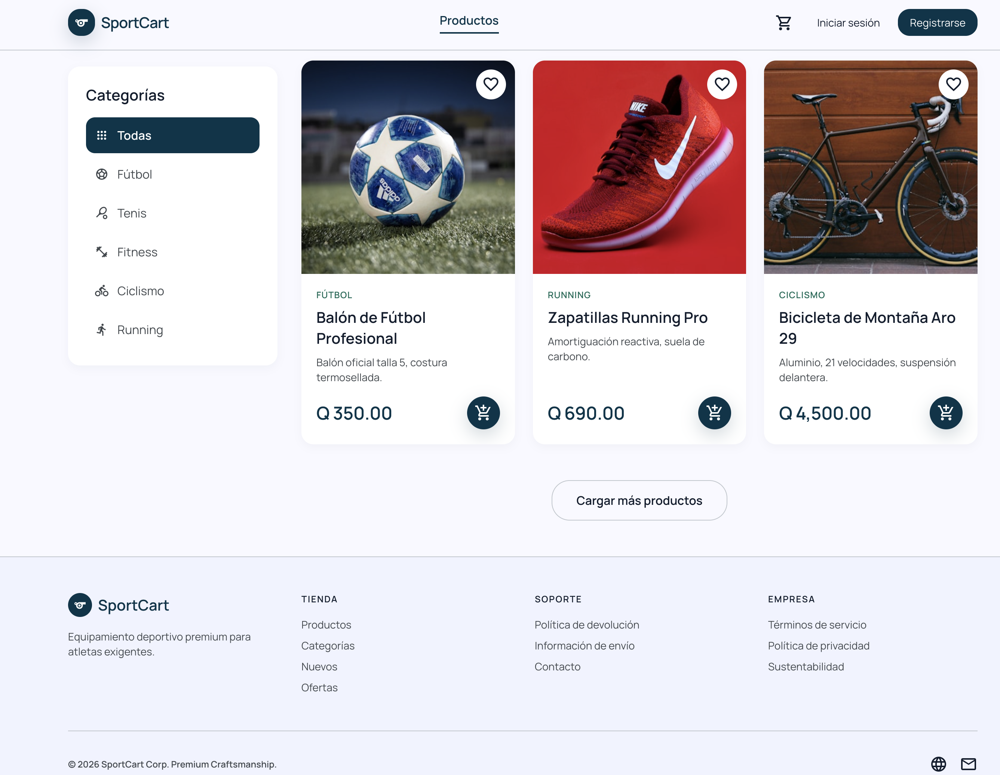

### Detalle de producto


### Login

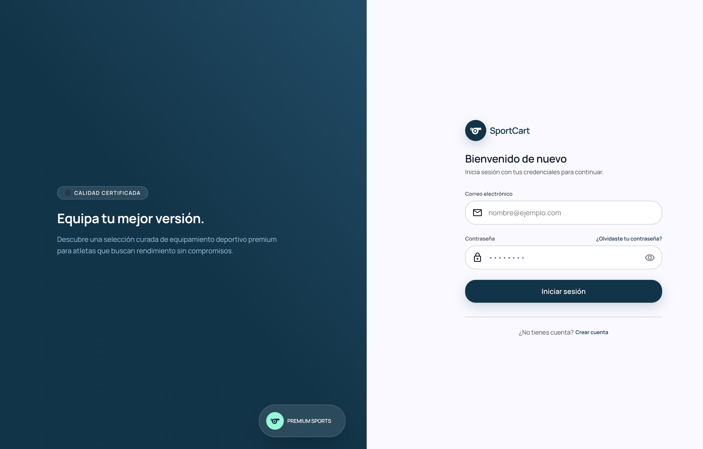

### Registro

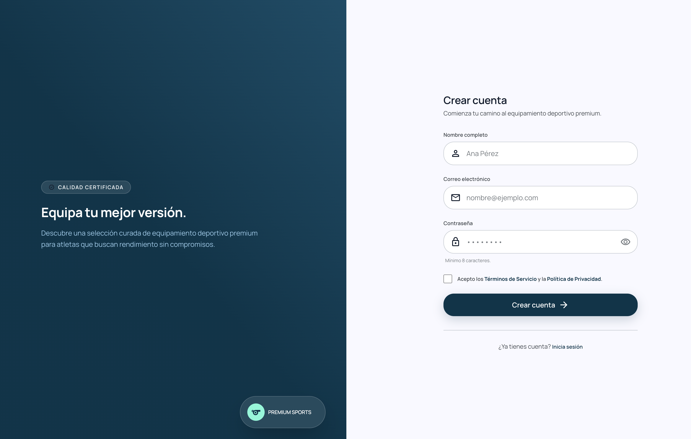

### Carrito de compras

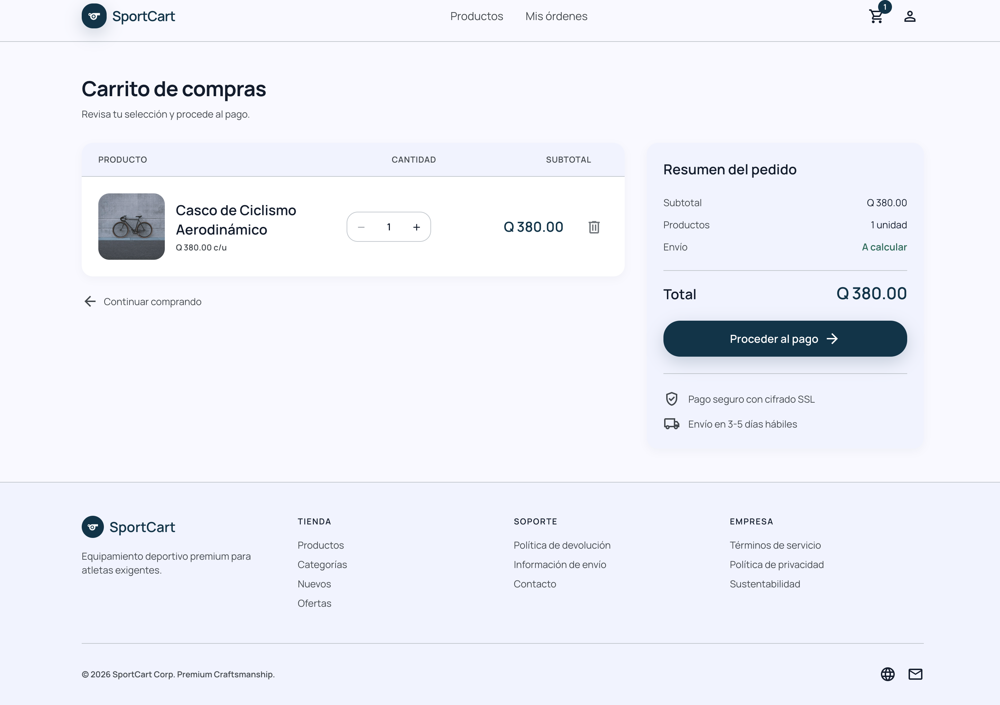

### Checkout - Paso 1: Envío

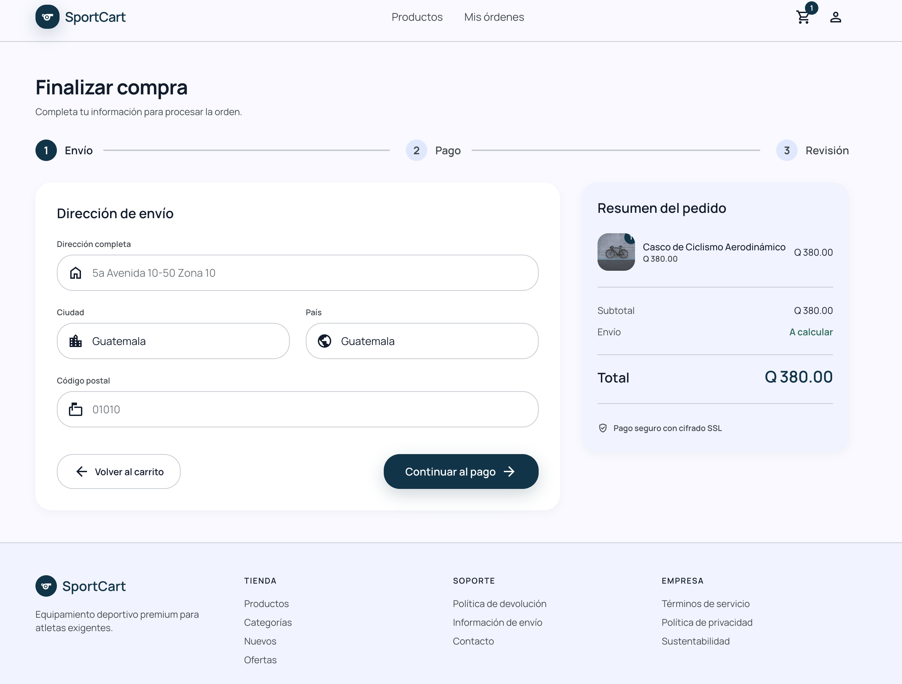

### Checkout - Paso 2: Pago

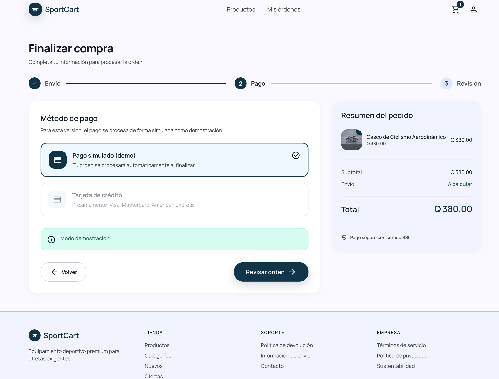

### Checkout - Paso 3: Revisión

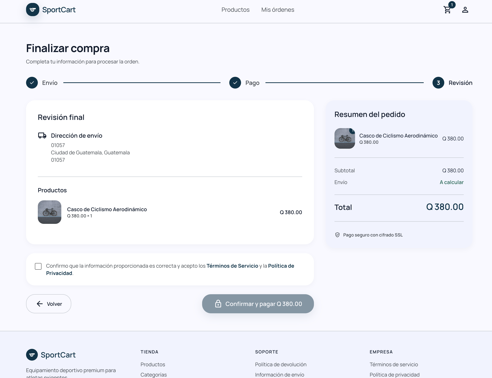

### Confirmación de orden

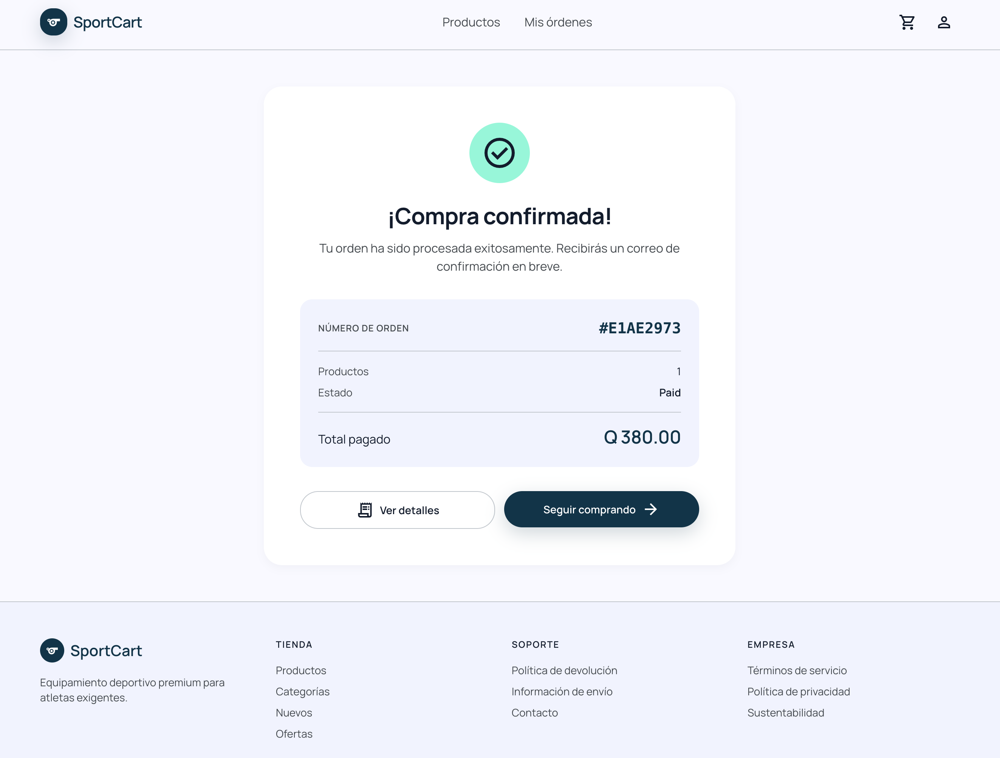

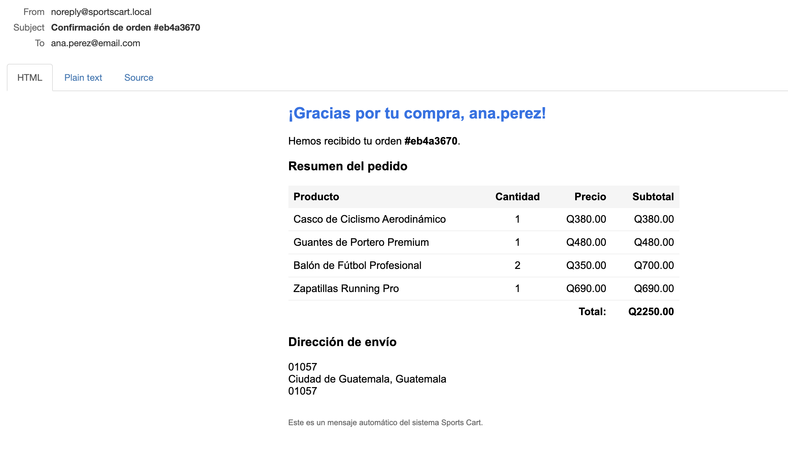

### Historial de órdenes

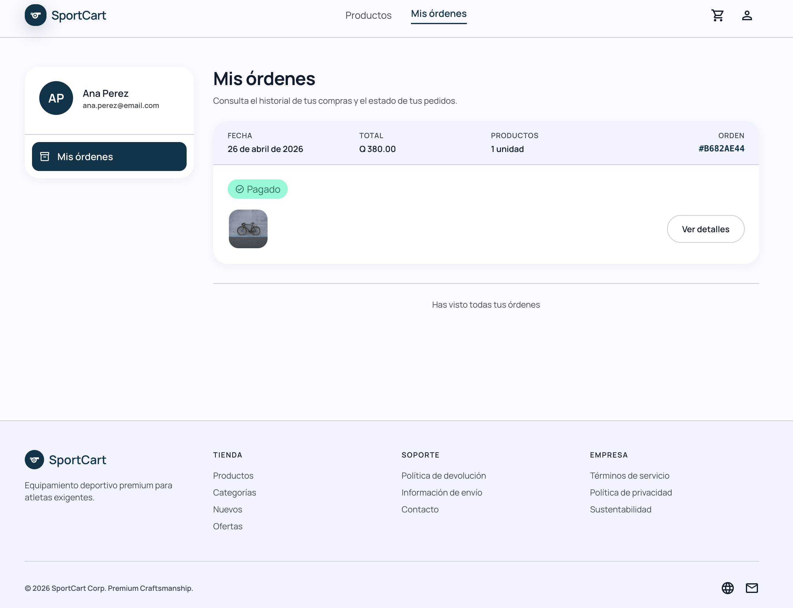

### Detalle de orden con tracking

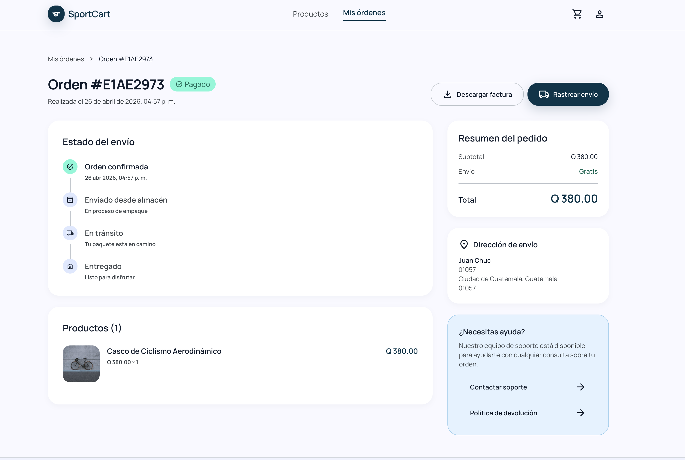

### Vista responsive (mobile)

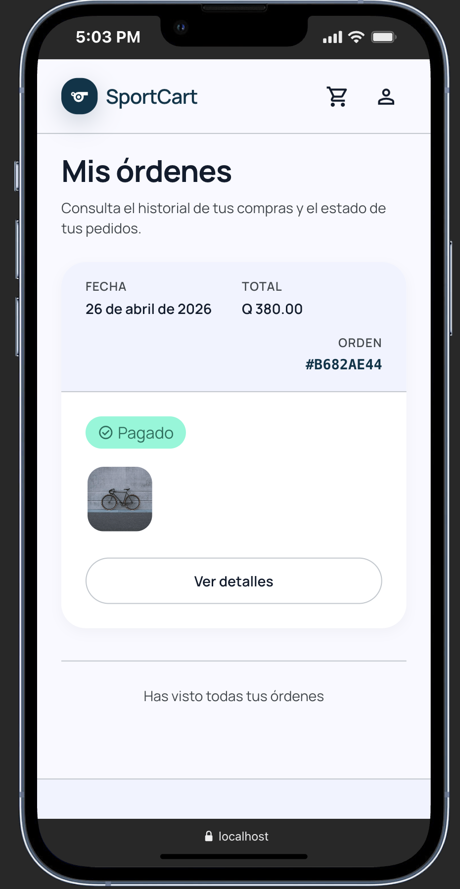
